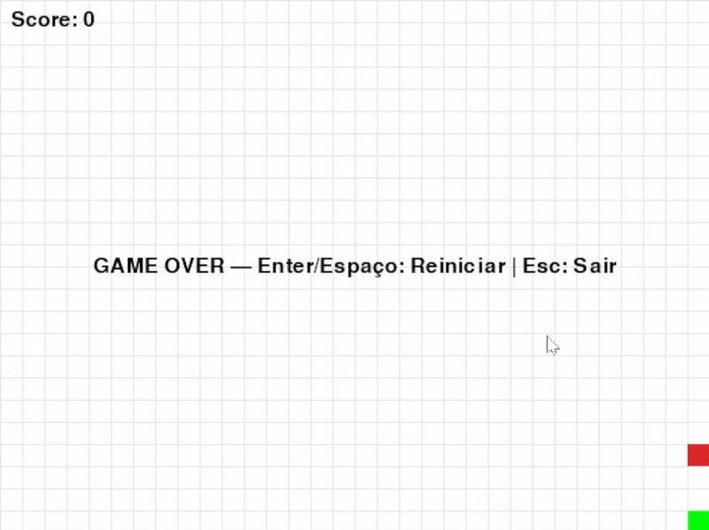

# 🐍 Snake Game — Python/Pygame

A classic Snake game rebuilt in **Python** with **Pygame**, designed with a modular structure and automated tests.

---

## 🎮 Demo

---

## ✨ Features
- Movement in grid with Arrow keys or WASD  
- Collision with walls and self-body  
- Growth when eating food  
- Real-time score  
- Instant restart (Enter/Space)  

---

## 🛣️ Roadmap
- [ ] ⚡ Speed Power-up (7s)  
- [ ] 🛡️ Invincibility Power-up (8s)  
- [ ] ✖2 Score Multiplier (10s)  
- [ ] 🌍 Themed maps with obstacles  
- [ ] 🗄️ Local ranking (SQLite)  
- [ ] ☁️ Online ranking (Flask API)  
- [ ] 🔊 Sounds and 🎨 skins  

---

## 🚀 How to Run

### ▶️ Local
# create virtual environment
python -m venv .venv
source .venv/Scripts/activate   # Git Bash on Windows
. .venv/bin/activate            # Linux/Mac

# install dependencies
pip install -r requirements.txt

# run the game
python -m src.snake
🧪 Tests
pytest -q

# 🎹 Controls
- ←/→/↑/↓ or WASD → move
- Esc → quit
- Enter/Space → restart

🛠️ Tech Stack
🐍 Python 3.12
🎮 Pygame
🧪 Pytest
⚙️ GitHub Actions (CI)